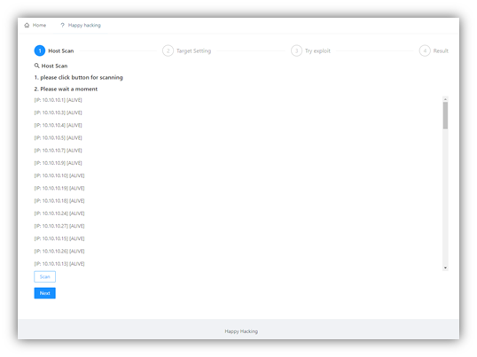
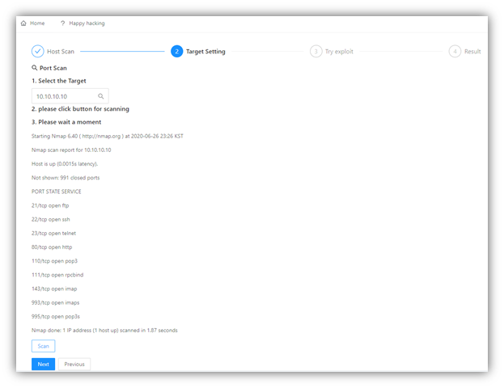
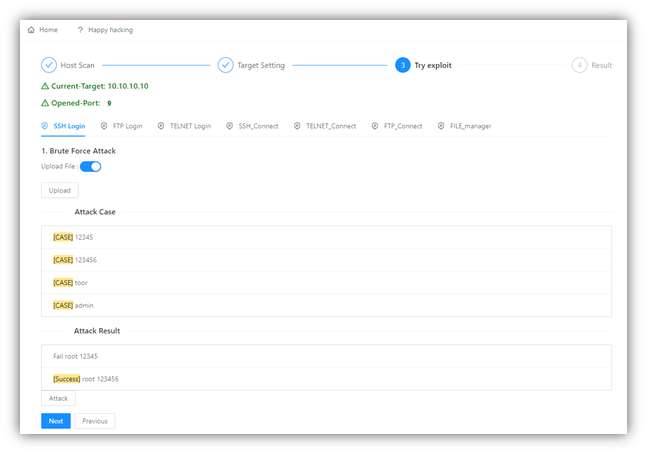
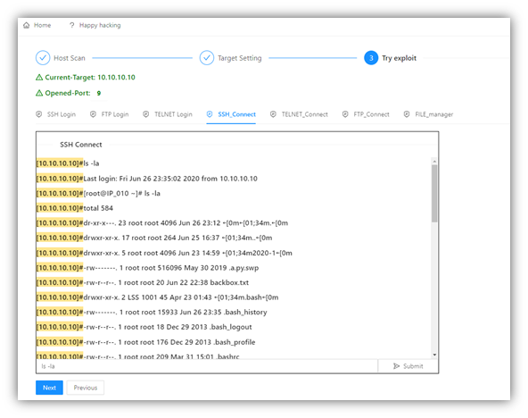
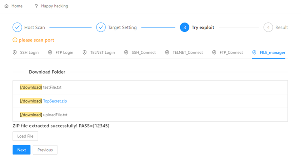
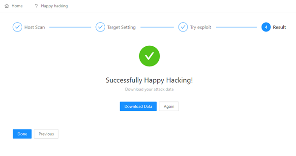
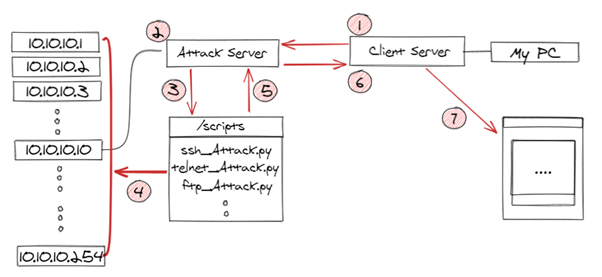

# vulnerability-scanner

## 프로젝트 결과물

---








---

## 프로젝트 구조

---



## 시나리오

---

여러대의 서버실 내에 한개의 서버를 감염시켜 모든 권한을 획득한 상태에서 다른 서버들의 취약점스캐닝 및 공격시도를 하는 상황

모든 공격은 외부에서 컨트롤하며 감염된 서버 내부 스크립트를 통해 스캐닝 및 공격이 이루어진다.

- 연결된 서버 스캐닝 (target 선정)
- Target 서버 포트 스캐닝
- SSH - brute force attack
- TELNET - brute force attack
- FTP - brute force attack
- ZIP Cracker - brute force attack
- Result report download - 공격 성공 데이터 다운로드

## 폴더 구조

---

```c
├─client
│  ├─dist   **[ webpack으로 번들링한 결과폴더 ]**
│  ├─public
│  └─src
│      ├─components **[ 화면에 그려지는 부분 ]**
│      │  └─views
│      │      ├─ExploitPage
│      │      │  └─Sections
│      │      ├─Footer
│      │      ├─HostScanPage
│      │      ├─LandingPage
│      │      ├─NavBar
│      │      │  └─Sections
│      │      ├─PortScanPage
│      │      └─ResultPage
│      ├─utils
│      ├─_actions  **[ 상태를 바꾸기 위한 행위 ]**
│      └─_reducers **[ action을 감지하여 상태를 변화 ]**
└─server
        ****├─config
        ├─middleware
        ├─model
        ├─routes  **[ 서버처리를 라우팅 분리 ]**
        └─scripts **[ 파이썬 공격 모듈 ]**
                 ├─download
                 └─upload
```

### ※ 노드js 설치하기

---

- [node.js 설치하기](https://nodejs.org/ko/)

## Quick Start (client, server 공통)

---

`**cd [저장위치]/attack/client**`
`**cd [저장위치]/attack/server**`
IDE(webstorm) 왼쪽 하단 Terminal 을 누르거나 개별 터미널창(cmd,iterm...)을 열어 프로젝트 폴더 위치(.../attack/client),(.../attack/server)로 이동

`**npm install`\*\*
을 입력하여 node 패키지를 설치합니다
프로젝트 내 라이브러리들은 package.json 에서 확인가능합니다.
성공적으로 설치가 마무리 되면 아래와 같은 메세지가 나옵니다.


---

**TIP**
그리고 취약성 관련 문구가 나온다면
`**npm audit fix**`
를 입력하면 자동으로 취약성문제를 fix해준다.


---

### client 설정

- **공격모듈 서버 주소 설정을 합니다.**

변경 위치 : **client/src/\_actions/attack_action.js**

**※ 12번째 줄 SERVER_ADDR 변수는 공격모듈 서버 주소를 설정하는 부분입니다.**

### 1.서버 주소 설정


```jsx
const SERVER_ADDR = 'http://'+ address or domain + :port + '/api/attacks';
							// ex)'http://localhost:5000/api/attacks
```

---

## server 설정

- **서버는 리눅스환경을 권장합니다.**
- **CORS 설정을 합니다.**
- **서버 포트를 설정합니다. [기본포트 : 5000]**
- **파이썬 모듈의 원할한 실행을 위한 모듈 설치.**

변경 위치 : **server/index.js**

### 1.CORS

웹은 기본적으로 '동일출저정책(Same Origin Policy, SOP)' 정책을  따릅니다.

이는 보안을 위한 기본정책으로, SOP는 하나의 출처(Origin)에서 로드된 문서나 스크립트가 다른 출처에 존재하는 리소스와 상호작용하지 못하도록 제약을 둡니다.

그런데, 간혹 이런 제약이 웹 응용프로그램을 만드는데 걸림돌이 되기도 합니다.

그래서 다른 출처와 상호작용하기 위해서 cors 미들웨어를 이용했습니다.

**※ 9번째 줄 다른 출처 사용시 cors_origin 배열에 주소를 추가해주면됩니다.**


```jsx
// 특정 외부 출처에 대해서만 요청 허가
//let cors_origin = [`http://localhost:8080`];
//
//app.use(
//  cors({
//      origin: cors_origin, // 허락하고자 하는 요청 주소
//      credentials: true, // true : 설정한 내용을 response 헤더에 추가 해줍니다.
//  })
//);

app.use(cors()); // 모든 외부 출처에 대한 요청을 허가
```

### 2.Port 설정

**※ 24번째 줄은 공격서버 포트설정입니다.**


### 3.외부 모듈

**※ 외부 모듈 설치**

```bash
1. yum -y install nmap (kali 기본설치)
2. pip install ping3
3. pip install netaddr
4. pip install ftplib
5. pip install telnetlib
```

---

### 실행

```bash
// client 와 server 각각 터미널에서 실행
npm run dev
```

---
